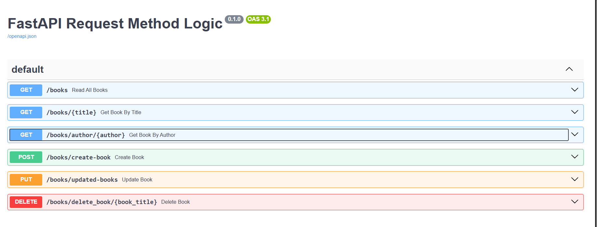
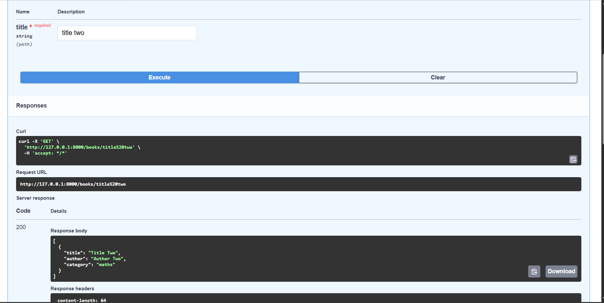
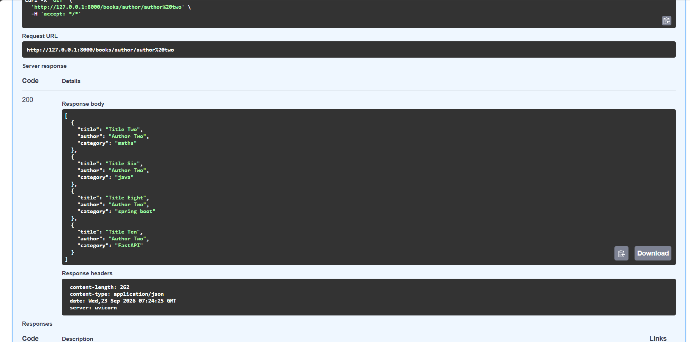
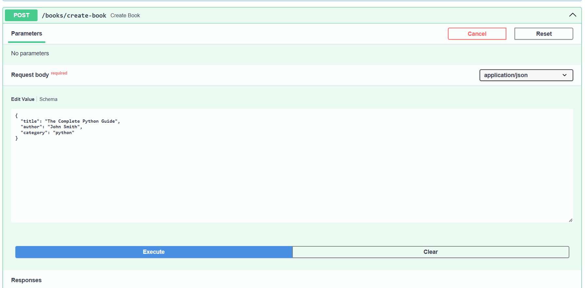
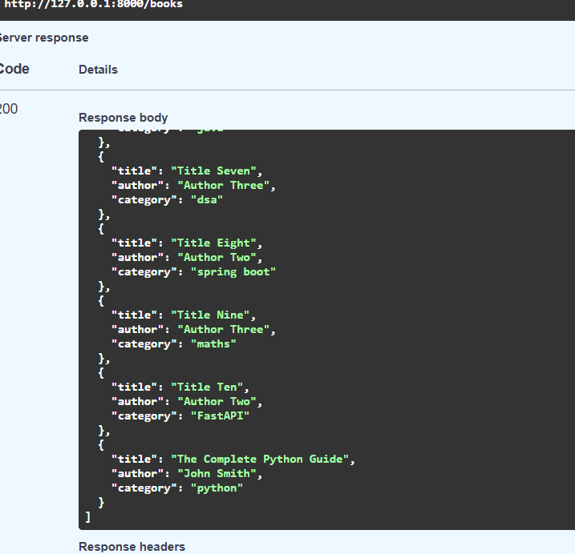
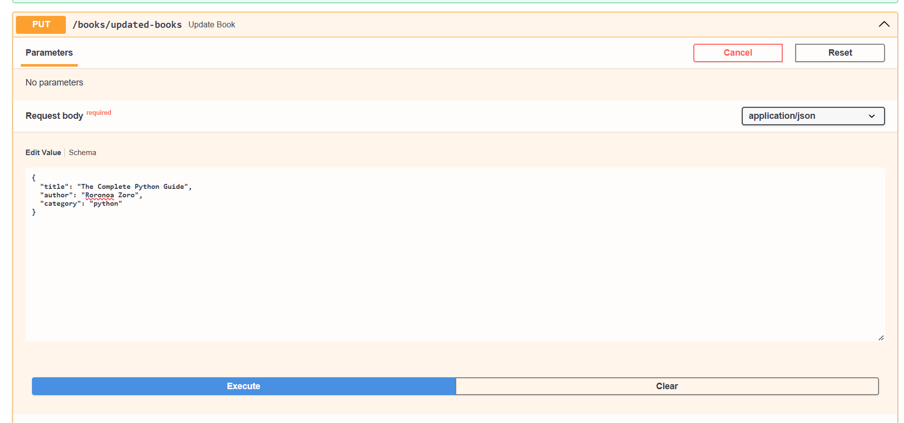
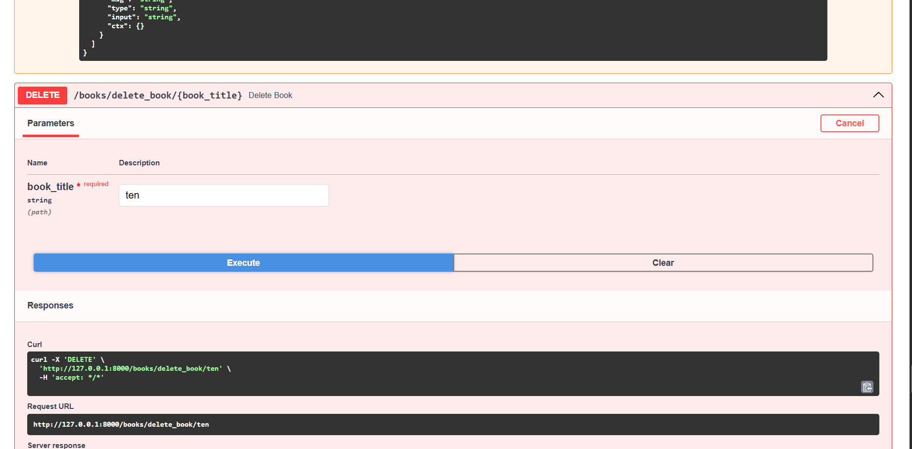
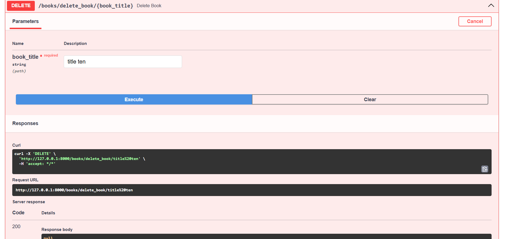
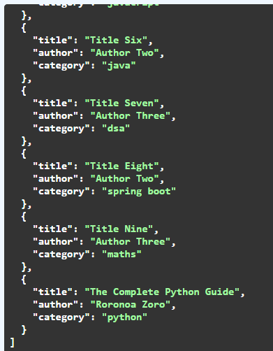

# FastAPI Request Method Logic

- In this Day we will learn about the CRUD operations
- C -> Create
- R -> Read
- U -> Update
- D -> Delete

## After this day we will be able to:-

- Get all the books from the dictionary
- Create the new book and store it in the exising dict
- Update the existing book present in the dict
- Delete any book we want 

### HTTP methods for CRUD

- GET       ->    READ
- POST      ->    CREATE
- PUT       ->    UPDATE (generally used to update the whole book / item)
- PATCH     ->    UPDATE  (it is used when we have to update only certain things not the whole items like(`title`, `author name`))
- DELETE    ->    DELETE THE BOOK

#### Here is the Result

### casefold()
casefold() is used for the strict lowercase