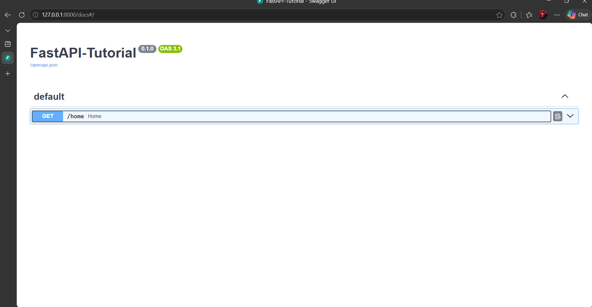
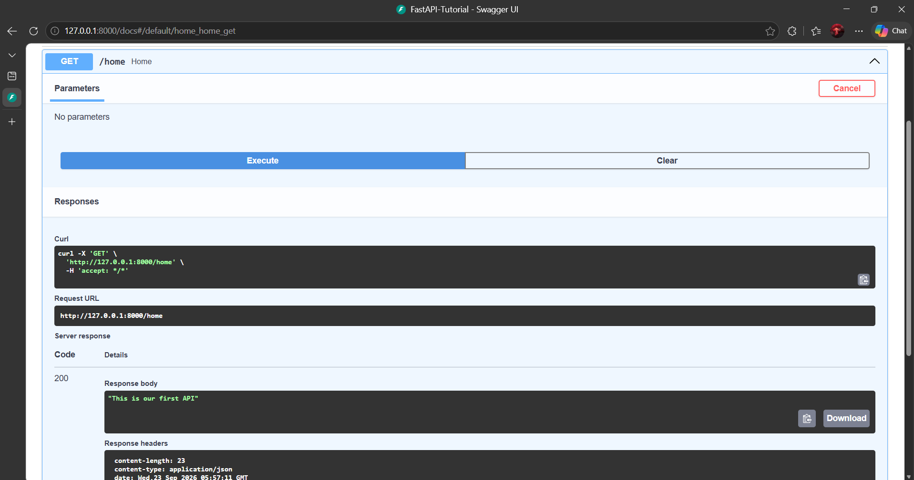

# command to set and activate the Virtual Environment for FastAPI
1. cmd1: Open the project root folder and write the command in the terminal:- python -m venv fastapienv(you can give any name to the env here)

2. cmd2: Activate the Environment:- fastapienv\Scrtipts\Activate.bat

3. Intall fastapi and uvicorn
- pip install fastapi
- pip install "uvicorn[standard]"

4. you can check the list of the dependencies/library using the cmd pip list

5. For Deactivating the environment we simply use: deactivate in the terminal

6. After creating the server and API, in the terminal we have to give run the server using the cmd: uvicorn main:app --reload

- (--reload) helps us to reload the server whenever we do some changes in any of the file, it(--reload) reduces the effort for run ther server everytime by own whenever we apply some changes in the file

## screenshots of the result on swagger ui

